  

---

## Featured Projects

### 🤖 Claude Mac App

A native macOS desktop application for [Claude Code](https://docs.anthropic.com/en/docs/agents-and-tools/claude-code/overview) — embedded PTY terminal, agent command center, SQLite persistence and local LLM integration via LM Studio.

**Stack:** Tauri 2 · React 19 · TypeScript · SQLite · node-pty · Rust

[→ Repository](https://github.com/AlexDesign420/claude-mac)

---

### 🎓 Syntax Sync

A native macOS wrapper for the Syntax Institut learning platform. SwiftUI sidebar, WKWebView session persistence, JavaScript data bridge and offline JSON cache.

**Stack:** Swift · SwiftUI · WKWebView · JavaScript

[→ Repository](https://github.com/AlexDesign420/SyntaxMacOs)

---

### ❤️ Health Advisor

A SwiftUI iOS app that reads Apple Health data — steps, activity, sleep, heart rate — and generates simple, visual daily health insights with charts and trend analysis.

**Stack:** Swift · SwiftUI · HealthKit · Swift Charts

[→ Repository](https://github.com/AlexDesign420/health-app)

---

### 🏎️ F1 Live Widget

A real-time Formula&nbsp;1 desktop widget for macOS ([Übersicht](https://tracesof.net/uebersicht/)).

- Live standings, race control, team radio
- Audio streams with integrated playback
- German text-to-speech commentary
- Weather, championship tables, race calendar countdown

**Stack:** Python · Flask · Übersicht · OpenF1 API · Jolpica API

[→ Repository](https://github.com/AlexDesign420/f1-widget)

---

### ⚽ WM 2026 Widget

A real-time FIFA World Cup 2026 desktop widget for macOS.

- Live scores from ESPN API
- 20+ radio streams (ARD, ZDF, BBC, NPR, …)
- German TTS commentary for goals and events
- Play-by-play feed and live ticker panel
- Responsive layout for 1440p – 4K displays

**Stack:** JavaScript · Python · Flask · Übersicht · ESPN API

[→ Repository](https://github.com/AlexDesign420/wm2026-widget)

---

## Open Source Contributions

### snow-cli — agent stream format fix

Six internal agents of [`MayDay-wpf/snow-cli`](https://github.com/MayDay-wpf/snow-cli) read the raw
SSE shape `chunk.choices[0].delta.content` while the stream had already been normalised to
`{ type: 'content', content }`. The mismatch only surfaced with OpenAI-compatible endpoints
(LM Studio, Ollama, vLLM, DeepSeek) and failed **silently** — the summary agent, the vision agent
and, most importantly, the auto-compaction agent simply received empty responses.

The fix removes the branch entirely and always reads the unified format: **24 insertions,
91 deletions**, `tsc` and `prettier` clean.

&nbsp;Merged 2026-07-17 · shipped in `v0.8.19`

[→ View the pull request](https://github.com/MayDay-wpf/snow-cli/pull/193)

---

## Tech Stack

**Languages & Frameworks**

**Tools & Platforms**

---

## Focus Areas

- **AI-assisted development** — Local LLM workflows, Claude Code, coding agents, LM Studio
- **Native macOS apps** — SwiftUI, WKWebView, Tauri-based desktop tools
- **Native iOS apps** — SwiftUI, HealthKit, Apple platform development
- **macOS desktop widgets** — Übersicht widgets with live data, audio and TTS
- **Live data integrations** — Sports APIs, streaming, real-time updates
- **Clean UI & documentation** — Readable code, structured READMEs, open source

---

## Project Philosophy

I build iteratively, test ideas in real projects and improve step by step.  
Every repository is designed to be usable, documented and presentable — even prototypes.

---

## Stats

---

## Contact

📫 **info.dejan@proton.me** · [GitHub](https://github.com/AlexDesign420)

<!-- profile -->
